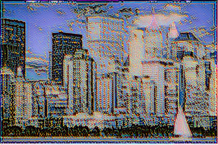
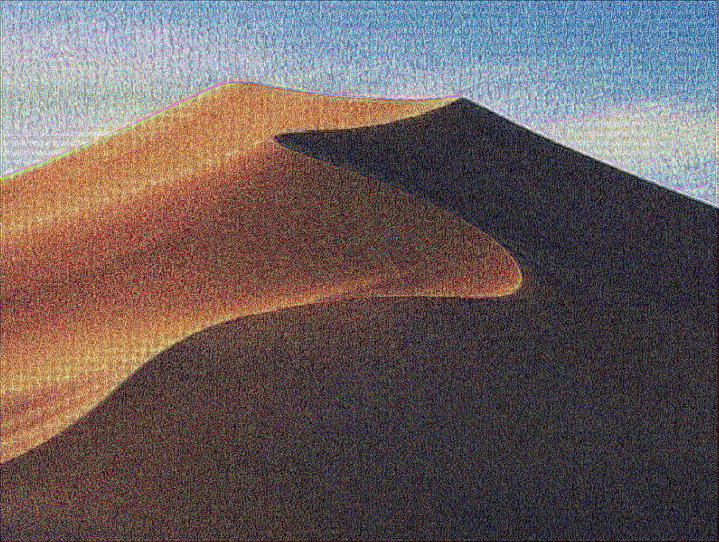

# Style Transfer

> Jialin Lu, luxxxlucy@gmail.com

## Intro

Implement Neural Style Transfer Algorithm Gatys et al. "A Neural Algorithm of Artistic Style" much of the code is based on the official tutorial However there is some critical issues that makes it not working. So I modified the code to make it work. And also organize the code for a cleaner structure.

Organized and rewrite by Jialin Lu <https://luxxxlucy.github.io>

## Usage

things you must define is the feature extracting net you want to use, as in the example notebook. I used the inceptionV3 and choose the 8-th layer to extract the feature.

The other very important things is you have to define for yourself is the exact value of loss. As you may know there are not just one loss in the style-transfer algorithm, defining those value has a great impact on how your result image would look like.

So please use try out the possibilities.

```
inceptionV3 = NetModel["Inception V3 Trained on ImageNet Competition Data"];
(* load a pretrained network *)

featureNet = NetTake[inceptionV3, 8]
(* carefully choose the layer *)


lossSpec = {"LossContent" -> Scaled[6.*10^-4], "LossStyle" -> Scaled[0.5*10^-6], "LossTV" -> Scaled[10^-10]};
(* carefully choose relative value *)
```

## Example

See the `example.nb`

## Samples




different resolution works all fine in this code



